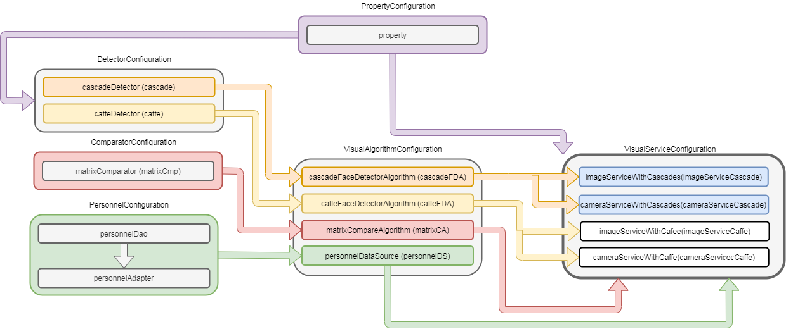
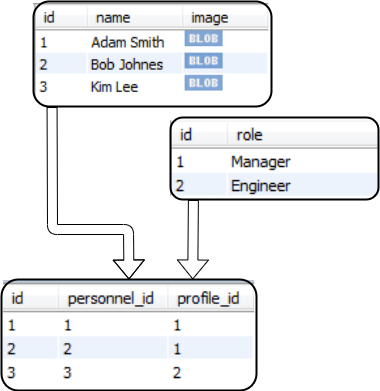
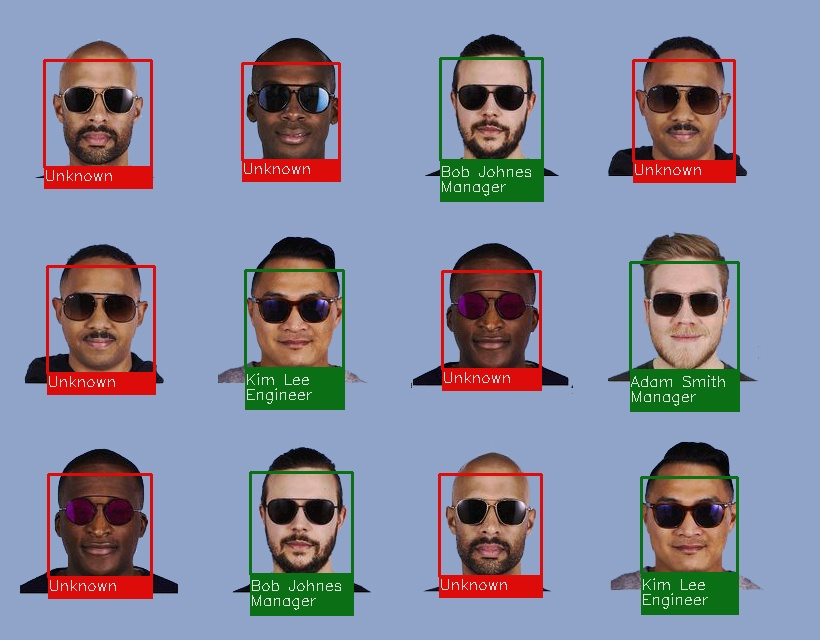
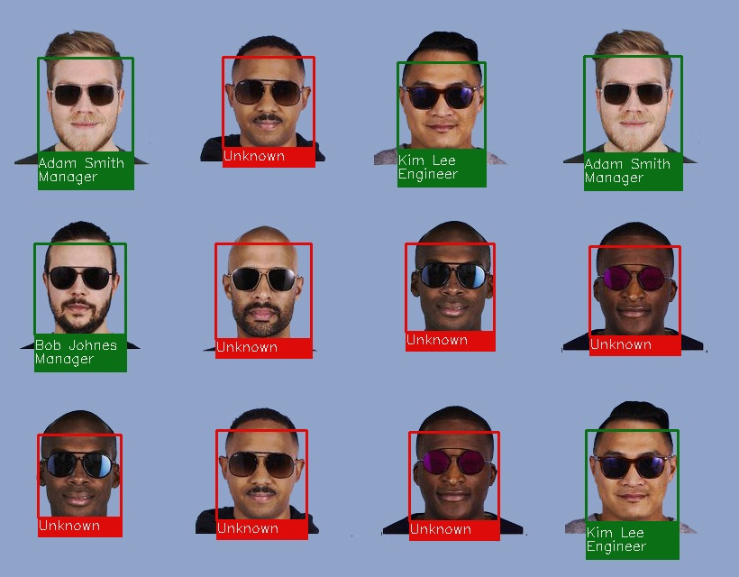

# face-catch
A variant of the project for determining valid images. This configuration used a small database with three faces that will be searched for in the input images. For face detection was used OpenCV lib with xml cascades.
# opencv
Unfortunately opencv does not compile correctly with maven dependency and have to be added manually to the build path
( <a target="_blank" href="https://docs.opencv.org/2.4/doc/tutorials/introduction/java_eclipse/java_eclipse.html#java-eclipse">How to add opencv</a> )
# properties
To configure inport/export files and files for image detection was used <a href="src/main/resources/settings.properties">settings.properties</a>.
# structure
</img>
# configurations
</img>
# data-source-example
For example was used MySQL database (<a href="src/main/resources/create_db.sql">create script</a>).
Hibernate configuration <a href="src/main/resources/face_catch.cfg.xml">face_catch.cfg.xml</a>
</img>
# example-results
</img>

</img>

