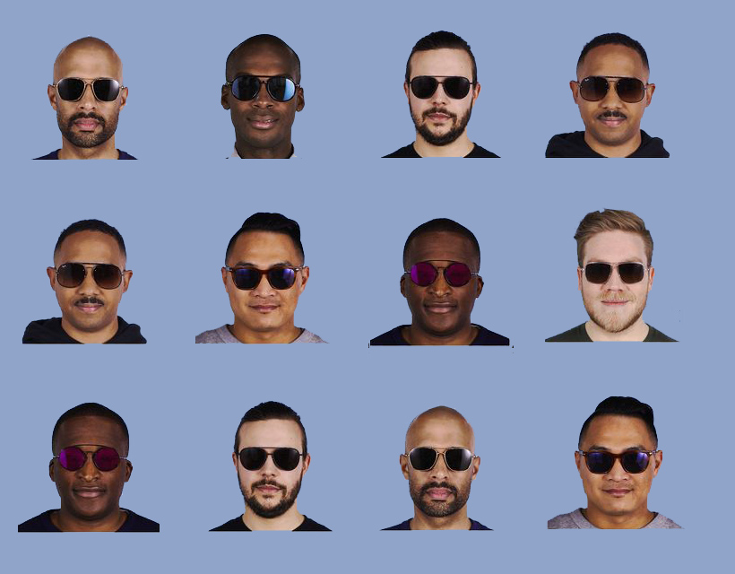

# face-catch
A variant of the project for determining valid images. This configuration used a small database with three faces that will be searched for in the input images.
# opencv
Unfortunately opencv does not compile correctly with maven dependency and have to be added manually to the build path
( <a target="_blank" href="https://docs.opencv.org/2.4/doc/tutorials/introduction/java_eclipse/java_eclipse.html#java-eclipse">How to add opencv</a> )
# example
For example was used MySQL database (<a href="src/main/resources/create_db.sql">create script</a>)

Input 1:

Input 2:

